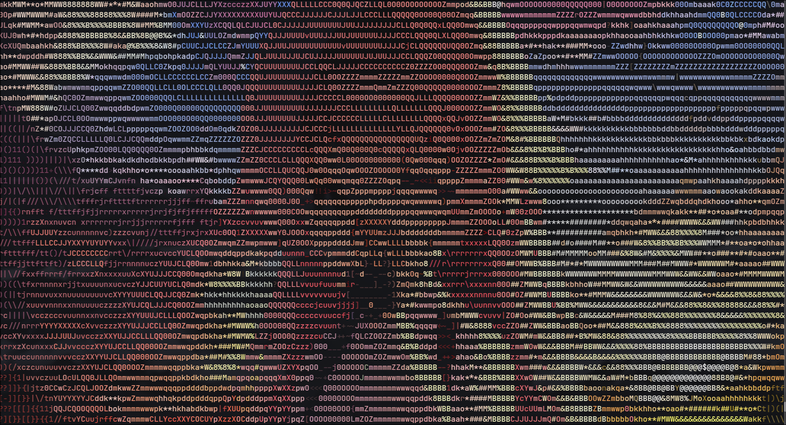
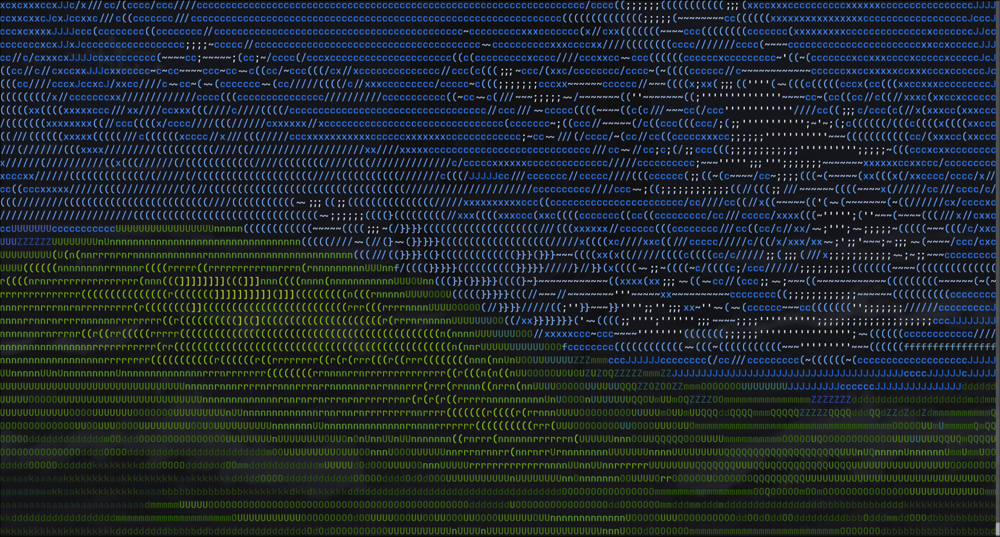

# ascify 🚀

A blazing-fast, lightweight command-line tool written in C that converts images and real-time videos into ASCII art directly in your terminal.

Designed for maximum performance, `ascify` uses pre-computed Look-Up Tables (LUTs), bitwise grayscale math, and buffered I/O to render high-resolution media flawlessly, including full 24-bit True Color RGB support.

---

## ✨ Features

* 🖼️ **Image & Video Support:** Renders static images natively and pipes video in real-time.
* 🎨 **True Color Rendering:** Opt-in 24-bit RGB ANSI color output for stunning terminal art.
* 📏 **Dynamic Scaling:** Automatically detects your terminal window size and scales media to fit perfectly while maintaining aspect ratio.
* ⚡ **Highly Optimized:** Zero floating-point math in the render loop and single-call `fputs` rendering for flicker-free video playback.
* 🌗 **Customizable:** Invert colors for dark-mode terminals, define custom ASCII palettes, and handle PNG transparency.

| Original | ASCII Art |
| --- | --- |
|   |   |
| --- | --- |
|  |  |

## 🛠️ Prerequisites

* `gcc` and `make` (for compiling)
* `curl` (used by the Makefile to fetch `stb_image.h`)
* `ffmpeg` (Required **only** for video playback)

*Note: `stb_image.h` is used for native image decoding and will be automatically downloaded by the Makefile during the build process.*

## 📦 Installation (Arch Linux / Generic Linux)

You can easily build and install `ascify` globally to your `/usr/local/bin` using the provided Makefile.

1. Clone the repository and navigate into it:

   ```bash
   git clone [https://github.com/yourusername/ascify.git](https://github.com/yourusername/ascify.git)
   cd ascify
   ```

2. Compile the highly optimized binary:

```bash
make

```

1. Install it globally (requires root privileges):

```bash
sudo make install

```

*(To remove the program later, simply run `sudo make uninstall`)*

## 🚀 Usage

Once installed, you can use the `ascify` command from anywhere.


### Basic Examples

**Render a static image (auto-fits terminal width):**

```bash
ascify image.jpg

```

**Play a video in real-time (Requires ffmpeg):**

```bash
ascify -v my_video.mp4

```

**Render an image with True Color (RGB):**

```bash
ascify -C picture.png

```

**Play a colored video at 60 FPS:**

```bash
ascify -v -C -r 60 gameplay.mkv

```

### Advanced Examples

**Invert colors (Crucial for Dark Theme terminals without RGB):**

```bash
ascify -i dark_image.jpg

```

**Force a specific width (e.g., 120 columns) and use a custom character set:**

```bash
ascify -w 120 -c " .:-=+*#%@" image.png

```

**Handle a transparent PNG with a custom background character (e.g., '.'):**

```bash
ascify -b "." logo.png

```

## ⚙️ Command-Line Options

| Flag | Description |
| --- | --- |
| `-v` | **Enable Video mode** (Pipes through `ffmpeg`). |
| `-C` | Enable **24-bit True Color RGB** rendering. |
| `-w <int>` | Set output width in characters (Defaults to terminal width). |
| `-i` | Invert brightness mapping (Best for dark terminal backgrounds). |
| `-c <str>` | Custom ASCII palette string, sorted from darkest to lightest. |
| `-b <char>` | Set background character for transparent pixels (Default: space). |
| `-r <int>` | Target playback framerate for video mode (Default: 30). |
| `-h` | Show the help menu. |

## 🧠 Under the Hood

`ascify` achieves real-time video terminal rendering by solving standard bottlenecks in C:

1. **Look-Up Tables (LUT):** Division and multiplication for brightness mapping are pre-computed 256 times on startup, reducing inner-loop math to `O(1)` memory lookups.
2. **Bitwise Luminance:** Floating-point RGB-to-Grayscale conversion is replaced with optimized bit-shifting `((R*77 + G*150 + B*29) >> 8)`.
3. **Flicker-Free Buffered I/O:** Frames are written to a dynamically allocated heap buffer and blasted to the standard output in a single system call (`fputs`), moving the cursor via ANSI escape sequences (`\x1b[H`) rather than wiping the screen.
